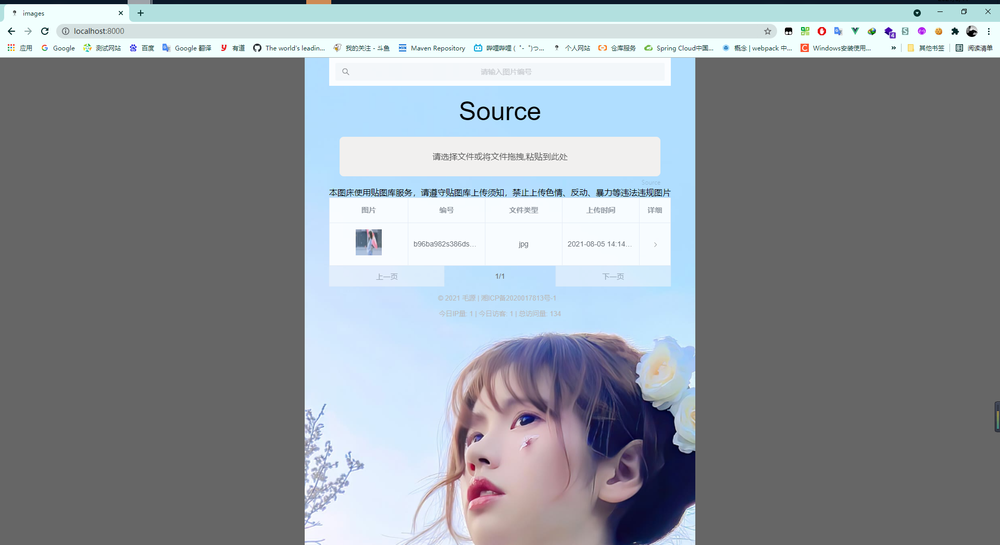
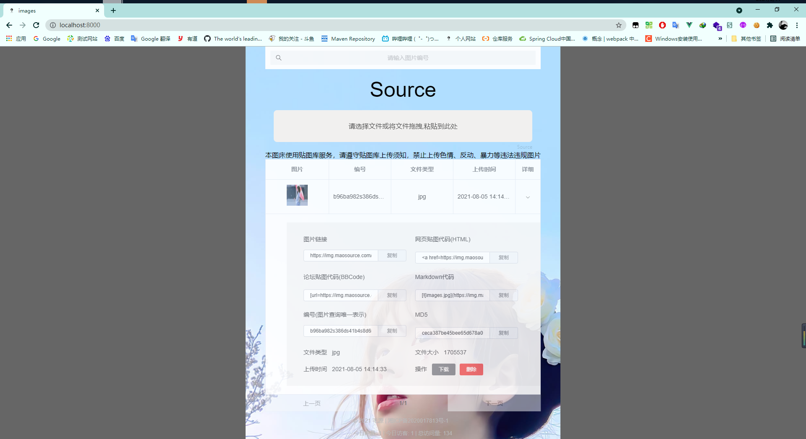
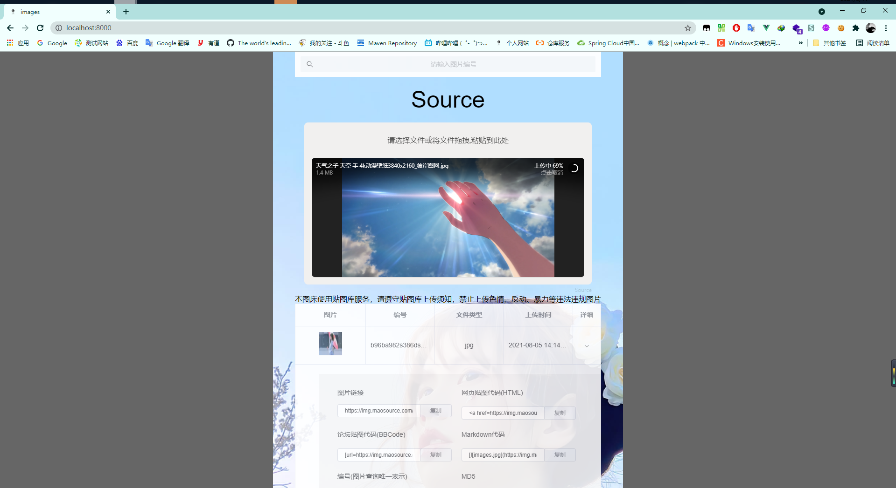
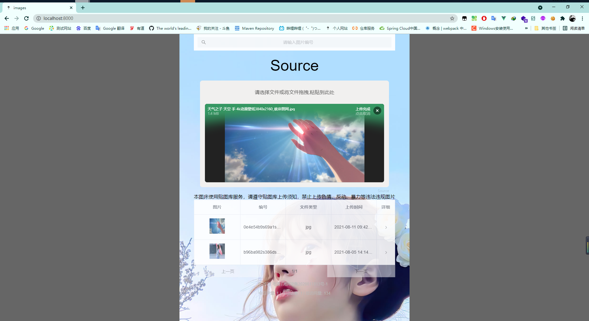
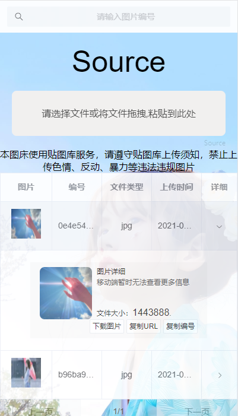
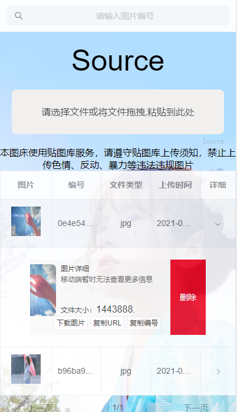

<h1 align="center"><a href="https://github.com/MaoSource" target="_blank">images</a></h1>

> images 是 [Img](https://github.com/halo-dev/halo) 的前端UI项目。
> 
> 主要技术：vue + vant + filepond + element-ui 对移动端和PC都做了适配

## 快速开始

拉取最新代码：

```bash
git clone https://github.com/MaoSource/images.git
```

页面截图












